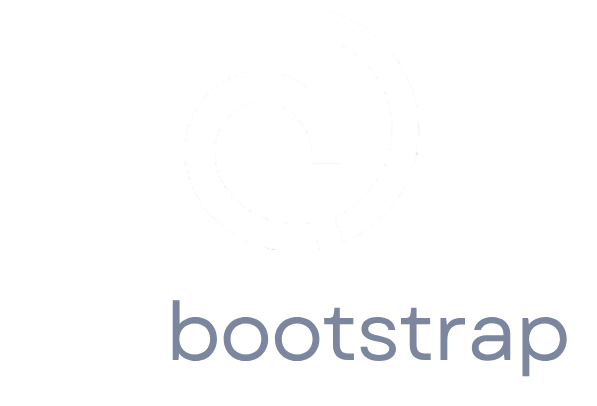

# dotbootstrap

<p align="center">
  
</p>

<p align="center">
  A fast, opinionated shell bootstrap for Mac and Linux machines.
</p>

<p align="center">
  <a href="#usage">Usage</a> ·
  <a href="#what-it-installs">What it installs</a> ·
  <a href="#configured-out-of-the-box">Configured out of the box</a> ·
  <a href="#ci">CI</a> ·
  <a href="#releases">Releases</a>
</p>

---

## Why dotbootstrap?

dotbootstrap gives you a clean, repeatable way to set up a development machine with the tools and shell config you actually use. It focuses on sensible defaults, minimal friction, and fast setup across macOS and Linux.

**Note:** This project is a foundation to build on—fork it, trim it, or extend it. What ships here reflects personal preferences, not a universal baseline.

## Usage

```sh
curl -sS https://sh.hanza.cc | sh
```

## What it installs

- Debian / Ubuntu: `build-essential`, `git`, `wget`, `curl`, `zsh`, `btop`, `ca-certificates`, `gnupg`, `ripgrep`, `fd-find`, `tmux`, `xclip`, `unzip`
- Arch: `base-devel`, `git`, `wget`, `curl`, `zsh`, `btop`, `ca-certificates`, `gnupg`, `ripgrep`, `fd`, `tmux`, `xclip`, `unzip`
- macOS: `git`, `wget`, `curl`, `zsh`, `btop`, `ripgrep`, `fd`, `tmux`, `xclip`, `unzip`, `ca-certificates`, `starship`, `neovim`, `uv`, `nvm`

## Configured out of the box

- `zsh` as the default shell when possible
- Starship prompt in `~/.zshrc`
- `~/.config/starship.toml`
- `~/.config/nvim/init.lua`
- `uv` and `nvm` shell initialization

## Included files

- `install.sh` for bootstrap orchestration
- `lib/` for shared platform helpers
- `configs/` for shell and editor defaults
- `tests/` for lightweight validation

## Notes

- The Linux `nvim` install pulls the latest upstream Neovim release.
- Docker on Linux uses the official `get.docker.com` installer.

## CI

GitHub Actions runs:

- `shellcheck` against the shell scripts
- `shfmt` formatting validation
- a small shell test to validate shared helper behavior and config linking

## Releases

Tagged pushes create a tarball bundle with the bootstrap script, library, configs, and README.

## License

Add your license here if you want the repository to show a clear reuse policy.
